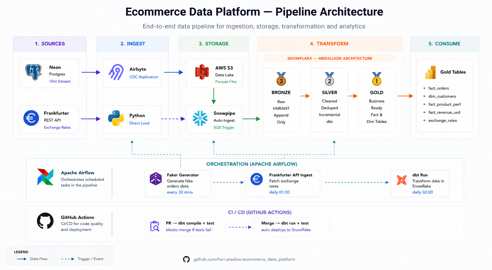
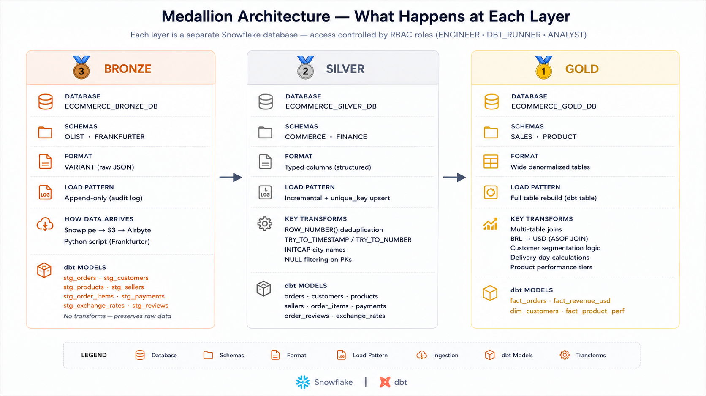

# Ecommerce Data Platform

An end-to-end data engineering project built on the [Olist Brazilian E-Commerce dataset](https://www.kaggle.com/datasets/olistbr/brazilian-ecommerce) and the [Frankfurter currency API](https://www.frankfurter.app/). The platform ingests, transforms, and serves data through a medallion architecture on Snowflake — orchestrated by Airflow and deployed via GitHub Actions CI/CD.

---

## Architecture





---

## Tech Stack

| Layer | Tool |
|---|---|
| Source (transactional) | Neon Postgres |
| Source (API) | Frankfurter REST API |
| Ingestion | Airbyte Cloud (CDC) |
| Data Lake | AWS S3 (Parquet) |
| Auto-ingest | Snowpipe (SQS trigger) |
| Warehouse | Snowflake |
| Transformation | dbt (incremental models) |
| Orchestration | Apache Airflow (Astro Cloud) |
| CI/CD | GitHub Actions |
| Data Generator | Python + Faker |

---

## Pipeline Flow

```
Neon Postgres (Olist)
    └── Airbyte CDC ──► AWS S3 ──► Snowpipe ──► Bronze
                                                    │
Frankfurter API                                     ▼
    └── Python Script ──────────────────────────► Bronze
                                                    │
                                                    ▼
                                               dbt Silver
                                          (clean + dedupe)
                                                    │
                                                    ▼
                                               dbt Gold
                                         (business tables)
```

---

## Medallion Architecture

### Bronze — `ECOMMERCE_BRONZE_DB`
- Raw data stored as **VARIANT** (JSON) — append-only, no transforms
- Schemas: `OLIST`, `FRANKFURTER`
- Loaded via Snowpipe (Olist) and Python script (exchange rates)
- Preserves full audit history

### Silver — `ECOMMERCE_SILVER_DB`
- Cleaned, typed, deduplicated
- **Incremental dbt models** with `unique_key` upserts
- `ROW_NUMBER()` deduplication handles CDC duplicates
- `TRY_TO_TIMESTAMP` / `TRY_TO_NUMBER` for dirty data
- Schemas: `COMMERCE`, `FINANCE`

### Gold — `ECOMMERCE_GOLD_DB`
- Business-ready fact and dimension tables
- Multi-table joins, BRL→USD conversion (ASOF JOIN), customer segmentation
- Schemas: `SALES`, `PRODUCT`

---

## Gold Tables

| Table | Description |
|---|---|
| `fact_orders` | Order-level metrics with delivery days |
| `dim_customers` | Customer segments (High / Mid / Low Value) |
| `fact_product_performance` | Product tiers by revenue and review score |
| `fact_revenue_usd` | Order revenue converted BRL → USD via exchange rates |

---

## Project Structure (simplified)

```
ecommerce_data_platform/
├── airflow/
│   ├── dags/
│   │   ├── faker_dag.py          # Generates fake orders every 30 mins
│   │   ├── frankfurter_dag.py    # Daily exchange rate ingestion
│   │   └── dbt_dag.py            # Daily dbt run + test
│   └── docker-compose.yaml
├── data_generator/
│   ├── seed_olist.py             # Initial Olist data load to Neon
│   ├── faker_generator.py        # Continuous fake order generator
│   └── frankfurter_to_snowflake.py  # Frankfurter API → Snowflake
├── ecommerce_dbt/
│   ├── models/
│   │   ├── bronze/               # Staging views over raw tables
│   │   ├── silver/               # Incremental cleaned models
│   │   └── gold/                 # Business fact + dim tables
│   ├── macros/
│   │   └── generate_schema_name.sql  # Custom schema naming
│   └── dbt_project.yml
├── snowflake/
│   ├── 01_setup.sql              # Databases, schemas, warehouses
│   ├── 02_roles.sql              # RBAC roles and privileges
│   ├── 03_snowpipe_setup.sql     # Storage integration, stages, pipes
│   └── 04_frankfurter_setup.sql  # Frankfurter schema + table
└── .github/
    └── workflows/
        ├── dbt_ci.yml            # PR: dbt compile + test
        └── dbt_deploy.yml        # Merge to main: dbt run + test
```

---

## Key Design Decisions

**CDC over full refresh**
Airbyte uses logical replication (WAL) on Neon Postgres. Only changed rows flow downstream — not full table dumps. This keeps Bronze append-only and Silver incremental.

**Full refresh | Overwrite for tables without PKs**
`order_items` and `order_payments` have no primary keys — CDC incremental isn't possible. These use a TRUNCATE + COPY INTO pattern via Snowpipe overwrite.

**SCD Type 1 (overwrite, no history)**
Silver merges on primary key — latest record wins. Chosen for simplicity; in production SCD Type 2 would preserve history for slowly changing dimensions like customer addresses.

**ASOF JOIN for exchange rates**
Frankfurter has no data for weekends/holidays. Gold uses Snowflake's `ASOF JOIN` to find the nearest available rate on or before each order date.

**Custom `generate_schema_name` macro**
dbt's default behaviour appends the profile schema to the model schema (e.g. `COMMERCE_OLIST`). A custom macro overrides this to use the schema exactly as defined in `dbt_project.yml`.

**RBAC with least privilege**
Three roles: `ECOMMERCE_ENGINEER` (human dev), `ECOMMERCE_DBT_RUNNER` (automation), `ECOMMERCE_ANALYST` (read-only). CI/CD uses `ECOMMERCE_DBT_RUNNER`.

---

## Orchestration

Three Airflow DAGs deployed on Astro Cloud:

| DAG | Schedule | Purpose |
|---|---|---|
| `faker_data_generator` | Every 30 mins | Inserts fake orders into Neon → triggers CDC |
| `frankfurter_ingestion` | Daily 01:00 UTC | Fetches exchange rates → loads to Bronze |
| `dbt_run` | Daily 02:00 UTC | Runs all dbt models + data quality tests |

---

## CI/CD

- **Pull Request** → `dbt compile` + `dbt test` run automatically. Merge is blocked if tests fail.
- **Merge to main** → `dbt run` + `dbt test` deploy models to Snowflake automatically.

Snowflake credentials are stored as GitHub Secrets — never hardcoded.

---

## Data Quality

dbt tests across all three layers:

- **`not_null`** on all primary keys
- **`unique`** on all primary keys in Silver and Gold
- **`accepted_values`** on `order_status` and `customer_segment`
- **`relationships`** — orders reference valid customers in Silver

---

## Setup

### Prerequisites
- Snowflake account
- Neon Postgres account
- AWS account (S3 bucket in same region as Snowflake)
- Airbyte Cloud account
- Astro Cloud account (for Airflow)

### 1. Snowflake Setup
```sql
-- Run in order
snowflake/01_setup.sql
snowflake/02_roles.sql
snowflake/03_snowpipe_setup.sql
snowflake/04_frankfurter_setup.sql
```

### 2. Environment Variables
Create a `.env` file (never commit this):
```
NEON_DATABASE_URL=postgresql://...
SNOWFLAKE_ACCOUNT=...
SNOWFLAKE_USER=...
SNOWFLAKE_PASSWORD=...
SNOWFLAKE_WAREHOUSE=ECOMMERCE_BRONZE_WH
```

### 3. Install Dependencies
`requirements.txt` file is added.
```bash
python -m venv .venv
source .venv/bin/activate  # Windows: venv\Scripts\activate
pip install dbt-snowflake snowflake-connector-python requests faker python-dotenv psycopg2-binary
```

### 4. Seed Initial Data
```bash
python data_generator/seed_olist.py
python data_generator/frankfurter_to_snowflake.py
```

### 5. Run dbt
```bash
cd ecommerce_dbt
dbt run
dbt test
```

### 6. GitHub Actions
Added these secrets to the GitHub repo :
- `SNOWFLAKE_ACCOUNT`
- `SNOWFLAKE_USER`
- `SNOWFLAKE_PASSWORD`
- `SNOWFLAKE_WAREHOUSE`
- `SNOWFLAKE_DATABASE`
- `SNOWFLAKE_ROLE`

---

## Dataset

- **Olist Brazilian E-Commerce** — 100k orders, 2016–2018, 9 tables
- **Frankfurter API** — Daily BRL/USD exchange rates, 2016–present, free with no API key

---

*I Built this as a portfolio project to demonstrate end-to-end data engineering skills.*